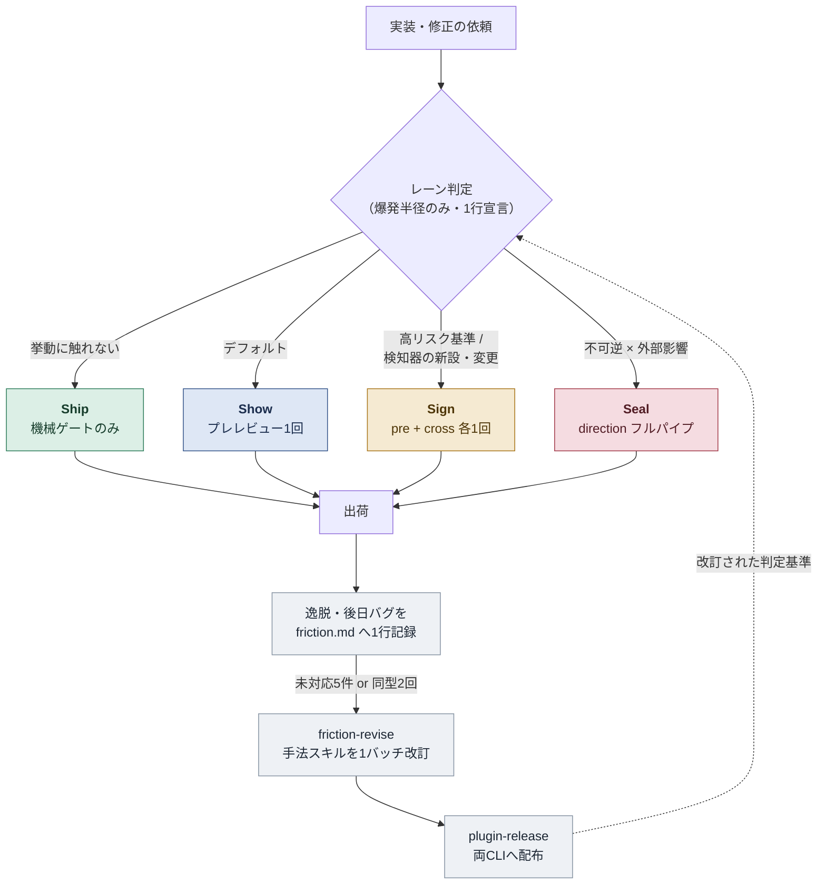
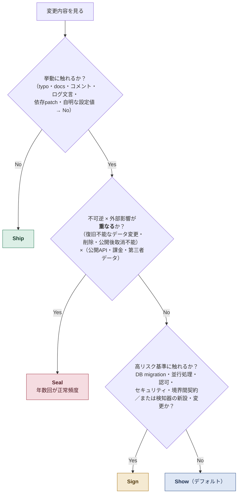
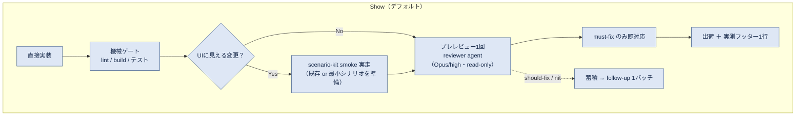
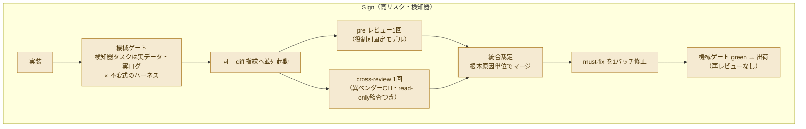
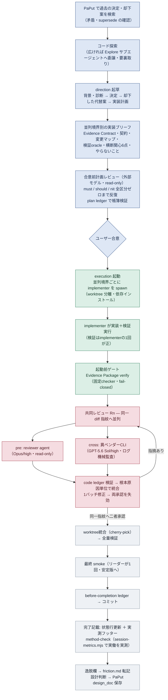
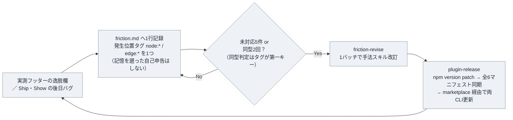

# 開発手法の全体像 — レーン制と direction 駆動フロー

爆発半径でレビュー工程の重さを決める4レーン（Ship / Show / Sign / Seal）を軸に、計画ドキュメント（direction）・実装工程（execution）・クロスモデルレビュー・実測（method-check）・摩擦ログの改善ループが噛み合う構造をまとめる。

正本は各スキル本文（`direction` / `execution` / `cross-review` / `method-check`）。本書は俯瞰用のまとめであり、記述が食い違う場合はスキル本文が優先する。スキル改訂時はこのドキュメントも同じコミットで追従させる。

## 1. 全体マップ

入口はつねに「レーン判定」。**レーンは変更の爆発半径だけで決まり、direction を書くかどうかとは独立**（direction は設計合意の道具であって、書いても実装工程は重くならない）。出荷後の逸脱・バグは friction ログに落ち、たまったら手法そのものを改訂して配布し直す — 手法自体が改善ループの対象になっている。

## 2. レーン判定 — 爆発半径で決める

判定の正本は `direction` スキルのレーン表。direction を起動しないタスクにも効かせるため、要約をグローバル CLAUDE.md / AGENTS.md に常駐させている（README のセットアップ参照）。**迷ったら重い側に倒す**。実装中に上位レーンの基準に触れると判明したら、その時点で昇格する。

| レーン | 基準（爆発半径） | 工程 | 使わないもの |
| --- | --- | --- | --- |
| **Ship** | 挙動に触れない変更 | 機械ゲート（lint / build / 該当テスト）のみ | レビュー全部 |
| **Show** | 下位2レーンに触れないすべて（デフォルト） | 実装 → 機械ゲート（UI変更なら scenario-kit smoke 実走）→ プレレビュー**1回** → must-fix のみ即対応 → 出荷。should-fix / nit は follow-up 1バッチ | cross-review・反復レビュー |
| **Sign** | 高リスク基準／検知器の新設・変更 | 実装 → 機械ゲート（検知器は実データ×不変式ハーネス）→ pre + cross を同一 diff 指紋へ**各1回** → 統合裁定 → must-fix 1バッチ修正 → 機械ゲート green で出荷（**再レビューなし**） | Evidence Package・ledger・収束ループ |
| **Seal** | **不可逆 × 外部影響が重なる**変更のみ | direction 起草 → 合意前計画レビュー → 合意 → execution → 共同レビューを二者承認まで収束 → 最終 smoke → 完了記載 | —（フルパイプ） |

> Show は原義（Ship/Show/Ask の「マージ後の事後レビュー」）と異なり、ここでは「出荷前の1回レビュー」を指す再定義。検知器（テスト基盤・検証スクリプト・パーサ・品質ゲート）の新設・変更は規模によらず Sign 以上 — 検知器自身の false green は静的レビューで見抜きにくいため、実データ×不変式の機械的敵対者と異ベンダーの独立実行検証を必須にしている。

## 3. Show / Sign の工程

日常の大半は Show で流れる。Sign はレビューを2系統に増やすが、**反復はしない**（修正後の再レビューをやめ、受け皿を機械ゲートと friction ループに移した）のがコスト設計の要点。

## 4. Seal フルパイプ — direction のライフサイクル

Seal だけが計画・実装・レビュー・証跡のすべてを通す。direction は `~/dev-notes/<プロジェクト>/direction/` に置き、参画プロジェクトのリポジトリを汚さない。**合意を求める時点で未決事項ゼロ**が起草の完成条件で、implementer がブリーフ＋名指しファイルだけで着手できる粒度まで落とす。

> direction を書いた作業の完了記載では、レーンを問わず `method-check` の実測が必須（実働・手法運用の分数は session-metrics.mjs の実測 JSON からのみ確定し、品質条件を満たさなければ「欠測」として省略する — 体感の自己申告はしない）。direction の無い作業でも、完了報告前に壁時計45分超または迂回・手戻り・環境復旧に約10分以上のいずれかに該当したら、`method-check` を実行してから報告する（セルフチェック。ユーザーの指摘を待たない）。

## 5. 登場コンポーネントとモデル割当

1リポジトリから3プラグインを配布する。共通スキルは Claude Code / Codex 両方、execution は各クライアント最適化版が1つずつ入る。

| コンポーネント | 役割 |
| --- | --- |
| `direction` | 実装計画のライフサイクル管理とレーン判定の正本 |
| `execution` | 計画ファイル駆動の実装工程（リーダーは分割・検証・レビュー起動・コミットに徹し、実装は teammate に任せる） |
| `cross-review` | 実行中クライアントと別ベンダーのモデル CLI に diff をレビューさせる。SHA-256 diff 指紋で同一性を担保し、ログ機械判定で read-only を監査 |
| `method-check` | セッションログから時間内訳を決定論的に実測（固定スクリプト）。問題は friction ログへ |
| `scenario-kit` | 1シナリオを demo 動画 / スクリーンショット / smoke 検証の3用途に使い回す |
| `plugin-release` | バージョンバンプ → tag push → 配布 → 両 CLI 反映の一気通貫リリース |
| `friction-revise` | friction ログを精査して手法スキルを1バッチ改訂（dev-method リポジトリ専用） |
| `bug-diagnosis` | 手強いバグ・性能劣化の診断ループ。再現ループ構築を本体に最小化・仮説・計装・回帰テストへつなぐ |
| PaPut 連携 | 起草前の過去決定検索・完了時の design_doc 保存で、プロジェクト横断の決定履歴を維持 |

モデル割当（正本は README のモデル割当表）:

| 役割 | Claude 版 | Codex 版 |
| --- | --- | --- |
| implementer（通常境界） | Sonnet / medium | GPT-5.6 Terra / medium |
| implementer-critical（高リスク境界） | Opus / high | GPT-5.6 Sol / high |
| プレレビュー reviewer | Opus / high | GPT-5.6 Sol / high |
| cross-review（異ベンダー呼び出し） | → GPT-5.6 Sol / high | → Opus / high |

実装は効率重視のモデル、レビューは役割別に固定した高性能モデル、そして**レビューの片翼はつねに別ベンダー** — 同系統モデルが共有する盲点を異種混成で潰す配分。高リスク role は高リスク編集面だけに局所割り当てし、同じ境界の通常変更へは伝播させない。

## 6. 改善ループ — 手法自体を計測・改訂する

ポイントは3つ。**実測主義** — 時間内訳は session-metrics の決定論的集計だけを採用し、体感で原因を決めつけない。**1バッチ改訂** — friction を1件ずつ直さず、トリガー到達時にまとめて改訂してリリースコストを抑える。**発生位置タグ** — 各エントリに主因1箇所のタグ（工程の内側なら `node:*`、工程間の受け渡しなら `edge:*`）を付け、同型判定と改訂対象の選定をタグ単位で行う。工程を跨ぐハンドオフ（完了報告の不達・spawn 時の指示漏れ・境界統合）は自由記述だと同型と気づきにくく、タグがあれば同型2回のトリガーを早く引ける。語彙の正本は `method-check` の friction 記録節。

## 7. 参考にしている手法・下敷きの概念

| 要素 | 下敷きになっている手法・概念 | この手法での翻案 |
| --- | --- | --- |
| レーン名と段階分け | **Ship / Show / Ask**（Rouan Wilsenach, martinfowler.com） | 3段を4段（Ship / Show / Sign / Seal）に拡張。Show を「マージ後の事後レビュー」から「出荷前の1回レビュー」へ再定義し、Ask を Seal 系譜として継承 |
| レーン判定基準 | リスクベースのレビュー tiering（blast radius による工程の重み付け） | 爆発半径**だけ**で決め、計画ドキュメントの有無や規模とは独立させた |
| direction | Design Doc 文化（Google 等）＋ **ADR**（Architecture Decision Records） | 決定・却下した代替案・契約を確定値で記録。加えて implementer AI がそれだけで着手できる「実装ブリーフ」粒度まで落とすのが独自要件 |
| cross-review | 異種冗長性（N-version programming / diverse redundancy） | 同系統 LLM が共有する盲点を、別ベンダーモデルの独立レビューで相殺。diff 指紋（SHA-256）で両者が同じ版を見たことを機械的に担保 |
| 故意ずれ検体 | **Mutation testing** | 検知器の新設・変更時に、契約の制約ごとに実装を別々に壊す入力を用意し、期待する非ゼロ終了を確認（検知器の false green 対策） |
| 検証設計 | **Test oracle** 概念・property-based testing の発想 | 「この退行をどのテストが検知するか」を契約ごとに列挙。隣接する fail-open 実装では合格しない「識別反証」を要求 |
| Evidence Contract / Evidence Package | **Proof-Carrying Code**（Necula & Lee, 1996–97。成果物が自らの正しさの証拠を携行し、受け手は小さな検査器で確認するだけ）＋ Assurance case / safety case（証拠と主張の索引） | PCC の「証拠携行」発想を形式証明抜きで翻案（direction 2026-07-21-3「Evidence-Carrying Direction」の命名も PCC のエコー）。契約に安定ID（`EC-*`）を付け、oracle・故意ずれ・検証ログ・diff 指紋を束縛した Evidence Package として最終 diff に随伴させ、固定 checker が機械検査する。ただし証明ではなく「証拠索引」であり、レビューの読解責務は免除しない |
| 二者承認・ledger | Two-person rule / dual control、監査ログ（append-only ledger） | Seal は同一 diff 指紋への pre + cross 二者承認が完了条件。帳簿は固定 checker だけが生成し手書き禁止、fail-closed 設計 |
| friction ループ | カイゼン／レトロスペクティブ、SRE の toil 計測 | 逸脱を1行ずつ記録し、閾値到達で手法スキル自体を改訂 → プラグインとして再配布。実測（session-metrics）で裏を取る |
| friction の発生位置タグ | **graph engineering**（マルチエージェント編成を有向グラフとして設計する語彙。2026年半ば〜） | 手法の工程をノード（計画・実装・レビュー・リーダー・機械ゲート）とエッジ（工程間のハンドオフ）とみなし、摩擦の主因がどちらで起きたかを1タグで記録。エージェント編成そのものは動的グラフ化せず（レーンによる静的トポロジー選択と teammate の短命化を維持）、観測の分類軸としてだけ取り入れた |
| 機械ゲート | CI quality gates | 全レーン共通の土台。レビューを減らした Sign / Show の「受け皿」として明示的に位置づける |
| execution | リーダー／実装者の分業（multi-agent orchestration） | リーダーは分割・検証・裁定に徹し実装しない。検証実行は implementer の1回を正とし、証跡（コマンド・exit code・件数）で確認して再実行しない |
