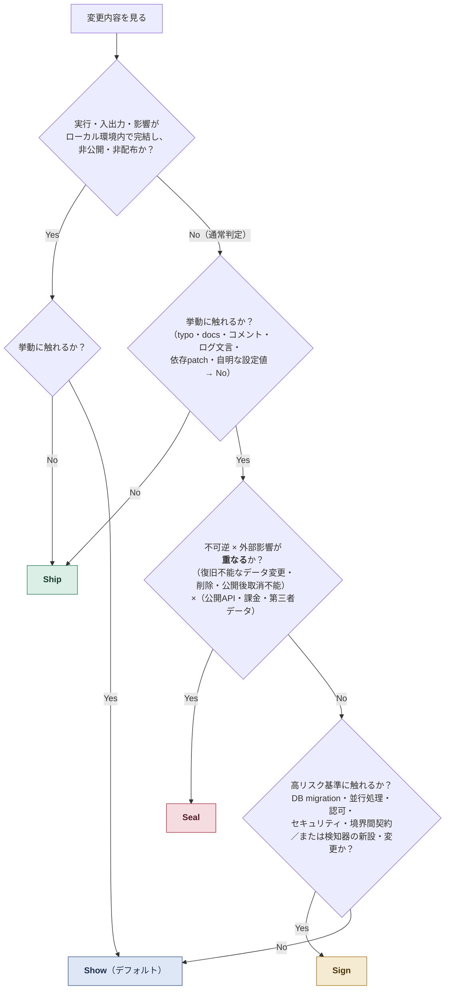

# dev-method

**レビュー工程の重さを「爆発半径」だけで決める、AI コーディングのための開発手順。** Claude Code / Codex のプラグインとして配布する。

AI に実装させると実装は速くなるが、代わりにレビューが詰まる。かといって全ての変更に重い儀式をかければ遅く、全部を軽くすれば事故る。この手法は変更を4つのレーン（**Ship / Show / Sign / Seal**）に振り分け、工程の重さをレーンごとに固定する。判定の軸は変更の規模でも計画ドキュメントの有無でもなく、**壊れたときにどこまで波及するか（爆発半径）だけ**にした。

導入に誰の合意も要らないことを前提に設計してある。計画ドキュメントはリポジトリの外に置き、レーン判定はグローバル設定に常駐し、プロジェクト側はゼロ設定で動く。チームに参画している案件でも、既存のレビュープロセスと競合せずに「自分が変更を作るまでの工程」としてそのまま使える。

- 手法全体の俯瞰（フロー図・参考にした手法の対応表）: [DEV_FLOW.md](DEV_FLOW.md)
- 設計判断の裏付けになった実測ログ: [docs/field-notes.md](docs/field-notes.md)

> 自分用に作って、いまも改訂を続けているものをそのまま公開している。要望への対応やサポートは約束できないが、考え方を参考にしてもらう分には自由（MIT）。

## 4つのレーン



ローカル例外は Seal → Sign → Show の通常判定より先に適用する。実行・入出力・影響がすべてローカル環境内で完結し、かつ非公開・非配布（成果物を公開・配布しない）のツールだけが対象で、挙動非変更は Ship、挙動変更は Show を上限とする。所有者が自分かどうかでは判定しない。scenario-kit・npm 公開物・プラグインなど、公開または配布する自己ツールは通常基準で判定する。

| レーン | 基準 | 工程 |
| --- | --- | --- |
| **Ship** | 挙動に触れない変更 | 機械ゲート（lint / build / 該当テスト）のみ。レビューなし |
| **Show**（デフォルト） | 下位2レーンに触れないすべて | 実装 → 機械ゲート → プレレビュー**1回**（must-fix のみ即対応、should-fix / nit は follow-up 1バッチ） |
| **Sign** | 高リスク基準／検知器の新設・変更 | 実装 → 機械ゲート → pre + cross を各1回 → 統合裁定 → must-fix 1バッチ修正 → 出荷（**再レビューなし**） |
| **Seal** | **不可逆 × 外部影響が重なる**変更のみ | 計画ドキュメント（direction）起草からのフルパイプ。二者承認まで収束 |

迷ったら重い側に倒す。実装中にローカル例外から外れる、または上位レーンの基準に触れると分かったら、その時点で通常判定へ戻すか昇格する。

## 設計の柱

**1. レーンは爆発半径だけで決まる。** 計画ドキュメントを書いたかどうかとは独立させた。計画は設計合意の道具であって、書いたせいで実装工程が重くなるなら誰も書かなくなる。

**2. レビューの片翼はつねに別ベンダー。** Sign 以上では、役割別の固定モデルによるプレレビューと、別ベンダー CLI（Claude ↔ Codex）による `cross-review` を同一 diff の SHA-256 指紋へ並列で当てる。同系統モデルが共有する盲点は同系統では潰せない。

**3. 反復レビューをやめた。** Sign は pre + cross を各1回だけ回して統合裁定し、修正後の再レビューはしない。受け皿は機械ゲートと、下記の摩擦ループに移してある。レビューを何周も回すのは、周回あたりの検出効率が落ちていくわりにコストが線形にかかる。

**4. 手法自体が改善ループの対象。** 出荷後の逸脱や後日バグは friction ログに1行ずつ落ち、閾値（未対応5件または同型2回）に達したらスキル本文をまとめて改訂し、プラグインとして配布し直す。時間内訳は体感ではなく固定スクリプトによるセッションログの実測（`method-check`）で取る。

**5. ローカル例外に該当しない検知器の変更は規模によらず Sign 以上。** テスト基盤・検証スクリプト・パーサ・品質ゲートといった「壊れを検知する側」の false green は静的レビューで見抜きにくい。実データ×不変式のハーネスと、故意にずらした検体の実行検証を必須にしている。

> Show という名前は Ship / Show / Ask（Rouan Wilsenach, martinfowler.com）から借りているが、原義の「マージ後の事後レビュー」ではなく「出荷前の1回レビュー」へ再定義している。下敷きにした手法の一覧は [DEV_FLOW.md](DEV_FLOW.md) の「参考にしている手法・下敷きの概念」を参照。

## インストール

Claude Code または Codex CLI が必要（両方に入れてもよい。`dev-method-claude` は Claude Code のみ、`dev-method-codex` は Codex のみ）。

```bash
# Claude Code
claude plugin marketplace add mizulba-dev/dev-method
claude plugin install dev-method@mizulba-dev
claude plugin install dev-method-claude@mizulba-dev

# Codex
codex plugin marketplace add git@github.com:mizulba-dev/dev-method.git
codex plugin add dev-method@mizulba-dev
codex plugin add dev-method-codex@mizulba-dev
```

| プラグイン | 中身 | インストール先 |
| --- | --- | --- |
| `dev-method` | 共通スキル: `direction` / `setup` / `cross-review` / `method-check` / `playwright-cli` / `scenario-kit` / `plugin-release` / `bug-diagnosis` / `keel` | Claude Code / Codex 両方 |
| `dev-method-claude` | `execution`（通常 Sonnet/medium・高リスク Opus/high）+ implementer/reviewer agents | Claude Code のみ |
| `dev-method-codex` | `execution`（通常 GPT-5.6 Terra/medium・高リスク GPT-5.6 Sol/high）+ implementer/reviewer 定義 + `SubagentStop` 終了通知 hook | Codex のみ |

スキル呼び出しは namespace 付き（例: `/dev-method:direction`）。`execution` は各クライアントに自分用の1つだけが入るため名前衝突しない。

### Claude Code: teammate 機能を有効化する

`dev-method-claude` の `execution` は implementer / reviewer を teammate として起動するため、Claude Code 側で teammate 機能が有効になっている必要がある。`~/.claude/settings.json`（`CLAUDE_CONFIG_DIR` を設定している場合はその配下）に次を追加する:

```json
{
  "env": {
    "CLAUDE_CODE_EXPERIMENTAL_AGENT_TEAMS": "1"
  }
}
```

起動ごとに切り替えたい場合は、環境変数の代わりに `claude --agent-teams` でもよい。Codex 側は別機構（`spawn_agent`）のため、この設定は不要。

実験的フラグのため名前が変わる・GA 化して不要になる可能性がある。teammate が起動しなくなったらまずこの設定を疑う。確認済みの挙動は [docs/field-notes.md](docs/field-notes.md) を参照。

## セットアップ: レーン判定を常駐させる

スキルはロードされて初めて効くため、`direction` を起動しない日常の変更（Ship / Show / Sign）にも着手前のレーン判定を効かせるには、`setup` スキルを1回実行する:

```text
# Claude Code
/dev-method:setup

# Codex
$dev-method:setup
```

これはグローバル設定ファイル（Claude Code は `CLAUDE_CONFIG_DIR/CLAUDE.md`、既定 `~/.claude/CLAUDE.md`。Codex は `CODEX_HOME/AGENTS.md`、既定 `~/.codex/AGENTS.md`）へ、版付きの `dev-method:implementation-lanes` 管理ブロックを1個だけ挿入する。実行中のクライアントだけを既定 target とし、`check → dry-run → 対象 path と操作の確認 → 明示承認 → apply` の順で進む。両方へ反映する場合だけ `all` を明示する。

管理外の本文・改行・末尾改行・file mode・symlink は保全する。壊れたマーカー、複数ブロック、編集済みの手動節、非 regular file、dangling symlink、1 MiB のサイズ上限超過のいずれかを検出したら、全 target を変更せず停止する。

挿入される全文は配布 asset の [global-lane-rules.md](src/plugin/skills/setup/assets/global-lane-rules.md) で事前に確認できる。プラグイン更新後は setup を再実行すると版差を検出して更新し、解除は `remove` を指定して承認する。

## 収録スキル

| スキル | 用途 |
| --- | --- |
| `direction` | 実装計画のライフサイクル管理と、レーン判定の正本。計画は `~/dev-notes/<プロジェクト名>/direction/` に置き、参画プロジェクトのリポジトリを汚さない |
| `execution` | 計画ファイルを入力に、実装 → レビュー → コミットまで回す実装工程。リーダーは分割・検証確認・裁定に徹し、実装は implementer に委譲する。Claude 版は teammate + SendMessage、Codex 版はサブエージェント（初回・定義更新時に `~/.codex/agents/dev-method-*.toml` を自動セットアップ） |
| `cross-review` | 実行中のクライアントとは別ベンダーのモデル CLI（`codex exec` / `claude -p`）に diff をレビューさせる。追跡済み差分と非 ignore 未追跡を含む SHA-256 指紋を返し、両者が同じ版を見たことを機械的に担保する |
| `setup` | レーン判定の常駐トリガーをグローバル設定へ版付き管理ブロックとして追加・更新・削除する |
| `method-check` | セッションログから開発時間の内訳と運用摩擦を実測する。固定スクリプトで決定論的に集計し、スキル手順の穴に該当するロスだけ friction ログへ記録する |
| `bug-diagnosis` | 手強いバグ・性能劣化の診断ループ。再現ループの構築を本体に、最小化・仮説立案・計装・正しいシームでの回帰テスト・掃除まで規律化する |
| `scenario-kit` | 1つの Playwright シナリオを3用途に使い回す: デモ動画（`run`）、ドキュメント用スクリーンショット（`shots`）、実装後の軽量検証（`smoke`） |
| `playwright-cli` | ブラウザ自動化 CLI の使い方（公式 @playwright/cli 配布スキルの取り込み） |
| `plugin-release` | バージョンバンプ → tag push → 配布 → 両 CLI 反映までの一気通貫リリース |
| `keel` | サービステンプレート keel からの新サービス立ち上げ: リポジトリ生成 → bootstrap 置換 → 動作確認 → PaPut・CLI 設定まで |

`execution` の運用上の要点として、**検証の実行は implementer の1回を正とし**、リーダーもレビュアーも証跡（実行コマンド・exit code・pass/fail 件数）で確認して再実行しない（例外は検知器変更時の異ベンダー独立実行検証のみ）。Seal では共同ラウンド開始時の同じ diff 指紋へ、役割別の固定モデル（Claude 上は Opus、Codex 上は GPT-5.6 Sol）の専用 reviewer と異ベンダー `cross-review` を並列起動し、両結果を根本原因単位に統合して、同一版への二者承認まで反復する。

### Evidence Package（Seal のみ）

Seal の Evidence Package は、direction で明示した既知契約と、その検証実行・ログ・対象差分を結び付ける**証拠索引**である。レビュー担当はこれを起点に確認を効率化できるが、形式証明でも完全性の保証でもない。二者の独立レビューは引き続き diff 全体と関連コードを読み、Package にモデル化されていないリスクや、証拠自体の妥当性も判断する。したがって、Package にないコードを確認不要とは扱わず、Package が green であってもレビューの読解責務を免除しない。

## モデル割当

役割ごとに Claude 版・Codex 版で使うモデルを固定する。実装は効率重視のモデル、レビューは役割別に固定した高性能モデルを使い、高リスク role は高リスク編集面だけに局所割り当てし、同じ境界の通常変更へは伝播させない。

| 役割 | Claude 版 | Codex 版 |
| --- | --- | --- |
| implementer（通常境界） | Sonnet/medium | GPT-5.6 Terra/medium |
| implementer-critical（高リスク境界） | Opus/high | GPT-5.6 Sol/high |
| プレレビュー reviewer | Opus/high | GPT-5.6 Sol/high |

`cross-review` は実行中のクライアントとは別モデルの CLI を呼ぶ: Codex 上で実行中なら Claude Opus/high を、Claude Code 上で実行中なら Codex の GPT-5.6 Sol/high を呼ぶ。

この表は `scripts/check-model-map.mjs` がスキル本文と突き合わせて検証する。改廃時は表とスクリプトの定数を同時に更新する。

## プロジェクト側の宣言（任意）

ゼロ設定で動く。例外プロジェクトだけ、ルートの `CLAUDE.md` / `CLAUDE.local.md`（untracked）に宣言する:

```
direction 置き場: <パス>          # 例: repo 内 docs/direction を維持したい場合
並列境界: <単位の説明>            # 例: モノレポで crm-api / crm-web をディレクトリ単位＋worktree 分離
```

## 既知の制約

- Codex 版のエージェント定義は plugin では配布できない（Codex の plugin ローダーが `agents/` を無視するため）。`execution` スキルが初回実行時と定義更新時に `~/.codex/agents/` へコピーする方式で回避している
- Codex 版 reviewer の read-only は、`spawn_agent` に sandbox 相当の指定が無いためプロンプト指示に依存する（Claude 側の `cross-review` は allowedTools + ログ機械監査で担保）
- Codex 版の interrupt_agent 運用・並列スポーンの安定性は未検証

詳細と実測日は [docs/field-notes.md](docs/field-notes.md) にある。

## メンテナ向け

<details>
<summary>リリース手順</summary>

1. 変更をコミット
2. `npm version patch` — version スクリプトが全6 plugin.json を自動同期して同一コミット + tag を作る
3. `git push origin main --follow-tags`（`git ls-remote --tags origin` で tag 到達を確認）
4. Claude Code: `claude plugin marketplace update mizulba-dev` → `claude plugin update dev-method@mizulba-dev` と `claude plugin update dev-method-claude@mizulba-dev`（適用は再起動後）
5. Codex: `codex plugin marketplace upgrade mizulba-dev` → `codex plugin add dev-method@mizulba-dev` と `codex plugin add dev-method-codex@mizulba-dev`（add が更新を兼ねる。適用は完全再起動後）

</details>

各プラグインは `.claude-plugin/plugin.json` と `.codex-plugin/plugin.json` の dual manifest を持ち、version は `npm version patch` で6マニフェスト全てへ同期される（`scripts/sync-plugin-version.mjs`）。スキル本文が正本で、`DEV_FLOW.md` は俯瞰用のまとめ。記述が食い違う場合はスキル本文が優先する。

## ライセンス

MIT
